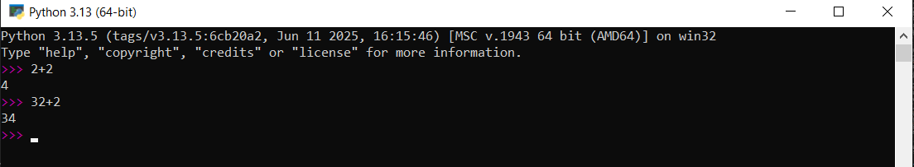

# Chapter 1: Building Abstractions with Functions

## Section 1.1: Getting Started

### 1. The Core Concepts
This entire section is about the practical setup and first contact with Python using the Python 3 application. It touches a bit on functions, objects, interpreters and some debugging principles to handle errors

- A language isn't something you learn so much as something you join.- (Arika Okrent)
- Python is human readable
- The Zen of Python serve as guiding principles to show Python's simplicity, beauty and readability. [(Pep-20)](https://peps.python.org/pep-0020/)


**Interactive controls.** 

Each session keeps a history of what you have typed. 

- Ctrl + P = Access the previous history
- Ctrl + N = Next
- Ctrl + D = Exit a session, and discards the current history.  
- Up and down arrows also move through history on some systems.



### 2. Code & Implementation

Start an interactive session in a terminal by typing: `python` or `python3`
and exit the session using `exit()`

#### ***Example*** 
The first example involves importing a function to access data on the internet.

```python
>>> from urllib.request import urlopen
```

- An import statement that makes a specific function available
- "urlopen" is the function we import that can open & access the data at a Uniform Resource Locator (URL), where it is located.

#### ***Statements & Expressions***
Broadly, computer programs involve instructions to either : 

1. perform some computations using `expressions`
2. perform some actions using `statements`

Python code also has statements and expressions. 

Thus : 
1. `Statements` describe actions that are carried out when executed.
2. `Expressions` compute values when evaluated. 

##### Example : An assignment statement

```python
>>> shakespeare = urlopen('http://composingprograms.com/shakespeare.txt')
```

- This statement performs an action. (Stores the value of an expression into 'shakespeare')
- The name '***shakespeare***' is given as the value of the expression following the assignment operator "=".
- That expression uses the function 'urlopen' to open a URL to get the complete text of William Shakespeare's 37 plays, all in a single text document.

#### Functions
Functions encapsulate (bundle together) the logic that manipulates data. 

- `urlopen` is a function
  - A web address is a piece of data. Shakespeare's text is another data.
  - Getting the data may be a complex process, but we can use a simple expression to do this, because all that complexity is placed within a function.

##### Example 2 : Another assignment statement

```python
>>> words = set(shakespeare.read().decode().split())
```

- This statement associates the name "words" to the set of all unique words in Shakespeare's text (33,721 words).
- Thus, we are essentailly performing an action here. 
- Each step (reading, decoding, splitting) takes the result from the previous step, processes it, and passes it along to the next step.
  - Read data from the URL
  - Decode the data into text
  - Split the text into words.
  - Place the words into an object called a set.

#### Objects
An object keeps the data together with the logic that manipulate that data (functions) in one place, making it easier to manage their complex nature.

A set is a type of object.
  - Set: An object that supports set operations like intersections, membership, etc.
  - In other words, Python sets work just like mathematical sets: they hold unique elements, have no order, and support operations like union, intersection, and difference.

##### Expression : 

```python
>>> {w for w in words if len(w) == 6 and w[::-1] in words}
{'redder', 'drawer', 'reward', 'diaper', 'repaid'}

```
- An expression that (computes) results in a value
- A compound expression that evaluates to the set of all words that are exactly six letters long and whose reverse is also in words.

    - Enter an expression in an interactive session and Python prints its value on the following line.

#### Interpreters
 To evaluate a compound expression, we need a procedure to interpret the code they way we expect it to be.
 An `interpreter` is a program the follows such a procedure, following the rules to read and execute code step by step. 
 - Thus the compound expressions will always produce the same results like we expect(predict), given the same code & input, following the procedure.


All these core concepts are closely related : 
- Functions are objects
- Objects are functions
- Interpreters are instances of both.

#### Errors

This sub-section encourages to be prepared for errors.

**Fundamental Equation of Computers :**
`computer = powerful + stupid `

- Computers are powerful but also very stupid and rigid.
  - They lack real insights. They are not like brains, because underneath, they are all just mechanical.

Thus: 
  - `Programming is about a person using their real insight, to build something useful, with the operations a computer can do.`
                ("Francisco Cai and Nick Parlante, Stanford CS101")

`Debugging` : Interpreting errors and finding out the cause of unexpected errors


##### Some Guiding Principles of debugging

- `Test incrementally` 
  - All well-written programs contain small, modular parts that we can text individually.
  - Thus, test or try out as soon as possible to identify errors early
- `Isolate errors` 
  - An error often result from a specific modular component.
  - Thus, when something goes wrong in your program, you should figure out exactly which small part of the code is causing it, instead of guessing or changing big chunks at once.
- `Check your assumptions` 
  - Interpreters perform instructions to the letter (No more, no less).
  - An interpreter will do exactly what your code says, not what you think/assume it says, so if the result surprises you, check whether your assumptions about how the code works are actually true.
- `Consult others` : 
  - If you’re stuck on an error, getting help from others can speed up finding the solution and also teach you new programming skills along the way.

***Emphasis*** : Incremental testing, Modular design, Precise assumptions, and Teamwork


**Full Code** : 

```python
>>> from urllib.request import urlopen
>>> shakespeare = urlopen('http://composingprograms.com/shakespeare.txt')
>>> words = set(shakespeare.read().decode().split())
>>> {w for w in words if len(w) == 6 and w[::-1] in words}
```


### 3. My Reflections & Questions

* **Reflections:** 
    * This section highlights some important concepts on what I can expect my program to do when I provide it to the interpreter. Also, some codes results in value whiles others perform some actions. I can notice some relationships between functions and objects
* **Questions:** 
    * What is the relationship between a function and an object and how are interpreters instances of both? 
    * When can we use the term 'function' or 'method' and in what context is this appropriate. ?

---

## Section 1.2:  Elements of Programming

